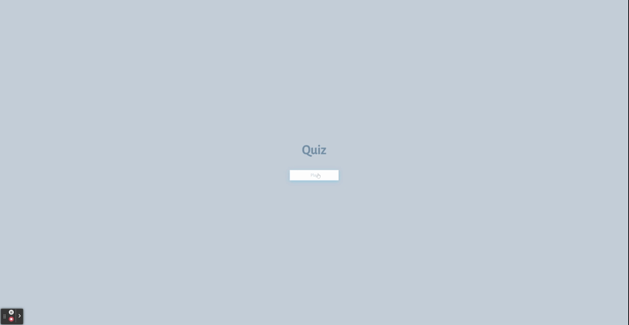
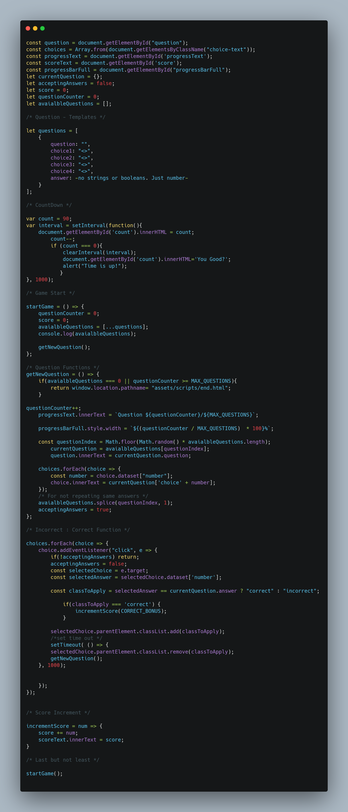

# Quiz Alert 

# Preview-Gif

# HTML # 
On this project, I will include 3 HTML files.
* index.html[^1] file.
* game.html[^2] file.
* end.html[^3] file.

[^1] index.html will present a play button and direct to game.html.
[^2] game.html will be where player will have 90 seconds to complete the quiz before getting alert for time's up!
[^3] end.html will have four buttons for user to either submit score, play again, main page, and visiting creator portfolio.

# CSS #
Use CSS to style the quiz, including the layout and visual elements such as colors and fonts.
* Style the start button to make it stand out and look like a button.
* Use CSS to style the layout of the questions and answers, such as positioning and spacing.
* Use CSS to style the timer, including the font size, color, and position on the page.

# JavaScript #

Use JavaScript to add interactivity to the quiz [^1], including starting the timer, presenting the questions, and handling user input.
* Add an event listener to the start button that will start the timer and present the first question when clicked.
* Create a function that presents the next question after the user has answered the previous one.
* Create a function that subtracts time from the timer when the user answers a question incorrectly.
* Create a function that ends the game when all questions have been answered or the timer reaches 0.
* Create a function that allows the user to save their initials and score after the game is over.

[^1]You should use JavaScript to hide and show questions and answers, handle user input, update the timer and validate if the answer is correct.

# References #

Here is all the reference that I used in this project

| Websites | Urls |
| -------- | ---- |
| Shield.io | [https://shields.io/] |
| Banner Maker | [https://banner.godori.dev/] |
| Javascript & Jquery | [https://javascriptbook.com/] |
| Carbon | [https://carbon.now.sh/] |

