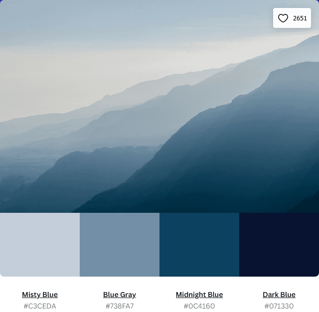

# Quiz Alert :memo: 

# Language #

# Snippet :clapper:

# HTML # 
On this project, I will include 3 HTML files.
* index.html[^1]
* game.html[^2]
* end.html[^3]

[^1]: index.html will present a play button and direct to game.html.
[^2]: game.html will be where player will have 90 seconds to complete the quiz before getting alert for time's up!
[^3]: end.html will have four buttons for user to either submit score, play again, main page, and visiting creator portfolio.

# CSS #
My favorite part of web development. Colors

* I had included a font from Google Fonts
* Picked out a color pallete and turned it into variable for easier mark up.

# JavaScript #

What I understand more on this project are these two terms
* document.getElementById
* document.getElementByClass
* I did look up into API a little bit but still having difficult with understand javascript. Wait for update

# References # :bookmark_tabs:

Here is all the reference that I used in this project

| Websites | Urls |
| -------- | ---- |
| Shield.io | [https://shields.io/] |
| Banner Maker | [https://banner.godori.dev/] |
| Javascript & Jquery | [https://javascriptbook.com/] |
| Carbon | [https://carbon.now.sh/] |
| YouTube | [https://www.youtube.com/] |
| StackOverFlow | [https://stackoverflow.com/] |

# Footnotes # :foot: